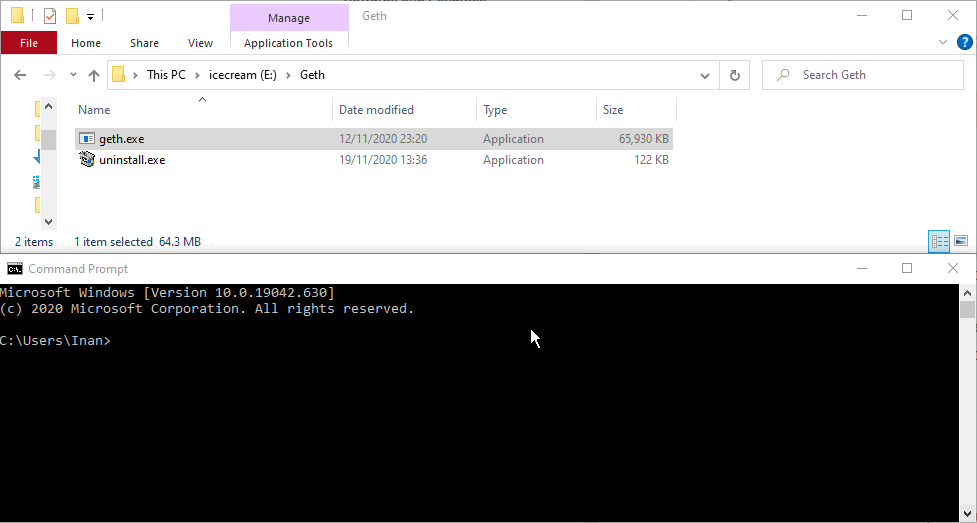
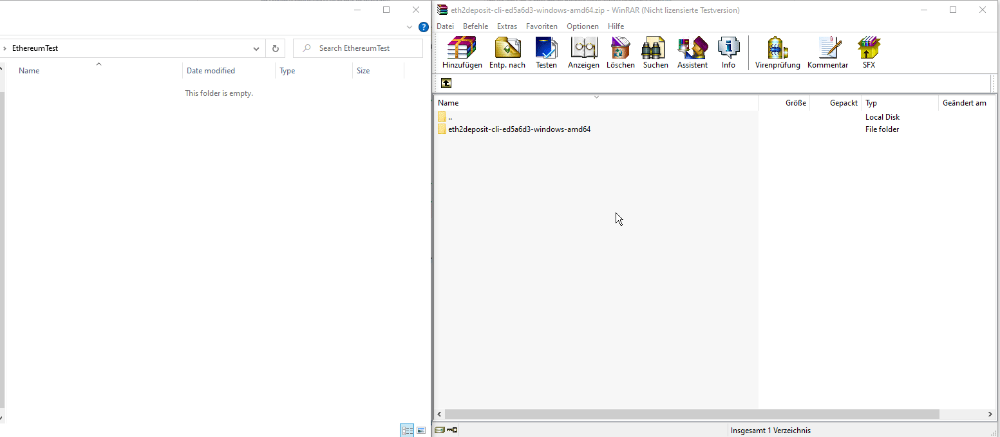
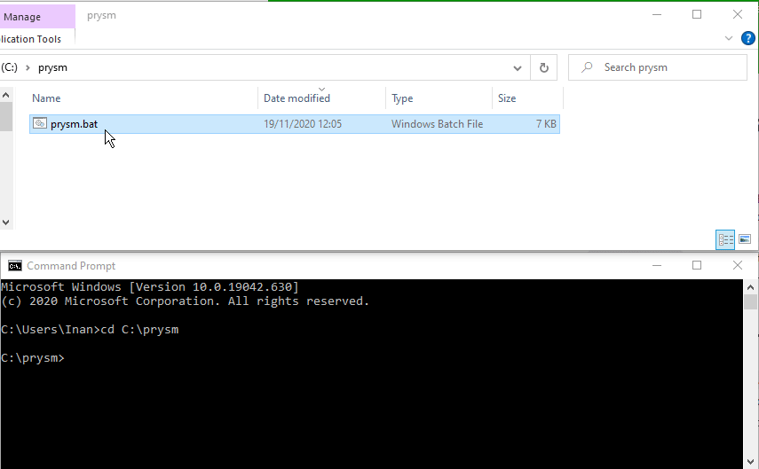
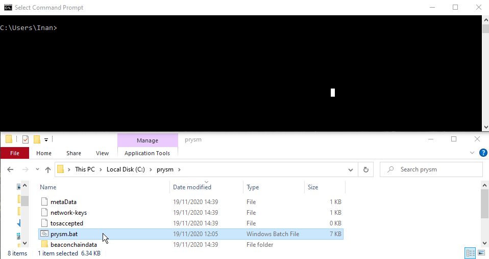
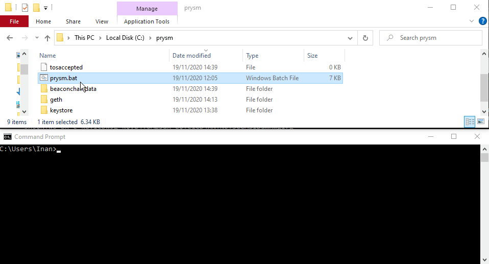
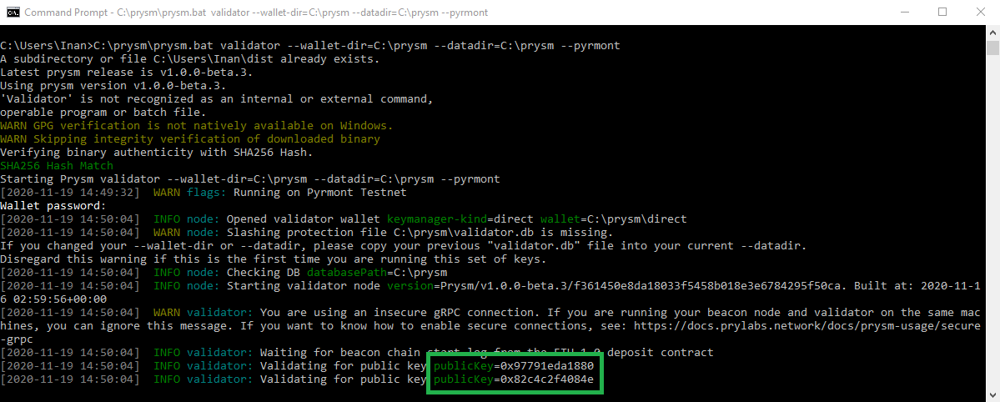

# Pyrmont Testnet: Prysm Client - Windows

## Disclaimer

The following steps only apply for the [**Pyrmont Testnet**](https://pyrmont.beaconcha.in/) and may be outdated in a few weeks as Ethereum 2.0 clients develop rapidly, however, we will try to keep these documents updated.  
There are multiple ways on how to get started, we will use the one which is the easiest as of now.    
  
[Official Prysm docs](https://docs.prylabs.network/docs/getting-started)  
[Prysmatic labs discord server](https://discord.gg/wJW7Rjk)

## [Official **Pyrmont** Launchpad](https://pyrmont.launchpad.ethereum.org/)

## **Choosing Eth1 & Eth2 clients**

Head over to ****the [Pyrmont launchpad](https://pyrmont.launchpad.ethereum.org/)  
Choose **Geth as your Eth 1** client and in the next step choose **Prysm as your Eth 2 client.**

## **Start Ethereum 1.0 Node**

1. Create a folder named `prysm` in `C:\`
2. Download [Geth](https://geth.ethereum.org/downloads/) and open a terminal window.
3. Double click the .exe `geth-windows-amd64-x.x.xx-cc05b050`. Once the installation is complete there should be **`geth.exe`** in the directory chosen during the installation. 
4. **Drag and Drop** the `geth.exe` file and add `--datadir="C:\prysm" --goerli --http`

This terminal window needs to run in parallel to the Ethereum 2.0 node, which will be covered in the next steps.   
Wait for the Ethereum 1.0 node to be in sync. The logs will look like the following once the node is in sync

## **Generate Key Pairs**

Choose the amount of validators you would like to run and Windows as the operating system.  
Each validator will cost 32 Goerli ETH.  
  
**Request** Goerli Eth from the r/ethstaker discord [here](https://discord.gg/3fAHvPD) or in the prysmatic labs discord [here](https://discord.gg/gmSMfrF).

## Creating keys

Download the [**eth2.0-deposit-cli**](https://github.com/ethereum/eth2.0-deposit-cli)

**Create** a new folder named **prysm** and **move** the downloaded file into **prysm**.

**Open a Terminal window** and drag&drop the **deposit.exe** file into the terminal as shown below.  
Follow the instructions to create your Ethereum 2.0 keys!  
**Drag and drop** the Eth2.0-deposit-cli file and **add** `new-mnemonic --chain pyrmont`

**WRITE DOWN THE GENERATED 24 WORD MNEMONIC PHRASE** 

Let's go to the **next page** and upload our `deposit-data-[timestamp].json` **file** \(located in the path shown in the terminal\)**, continue** and deposit 32 goerli Eth**.**  

## Downloading Prysm


This is only required for the initial setup


#### Open a Terminal window and run: 

1.  `mkdir prysm && cd prysm`  creates a folder named "prysm" 
2. `curl https://raw.githubusercontent.com/prysmaticlabs/prysm/master/prysm.bat --output prysm.bat` Downloads the prysm.bat file 
3. `reg add HKCU\Console /v VirtualTerminalLevel /t REG_DWORD /d 1` Changes some vizulations in the terminal window

## Importing validator keys 

**Drag and drop** the prysm.bat file and **add** `validator accounts import --keys-dir=` **AND** the path to your newly created keys**.** For this example the path is `C:\Users\Inan\validator_keys`

**Which results**   
`prysm.bat validator accounts import --keys-dir=C:\Users\Inan\validator_keys`

**Enter a new wallet directory and a new password.**   
In this example we chose `C:\prysm` as the new wallet directory.

## **Start the beacon node**

Open a new terminal window, **drag & drop the prysm.bat** file and add  
`beacon-chain -datadir=C:\prysm --http-web3provider=http://localhost:8545/ --pyrmont`

## **Start the validator node**

Open a new terminal window, **drag & drop the prysm.bat** file and add  
`validator --wallet-dir=C:\prysm --datadir=C:\prysm --pyrmont`

Enter your wallet password which was set in the previous step.   
Find the **validator public keys** in the logs

Enter your wallet password which was set in the[ previous step](https://kb.beaconcha.in/guides/tutorial-eth2-multiclient/medalla-testnet-prysm-client-windows#importing-validator-keys).   
**That's it. We are done! Your setup should now have three running terminal windows**

Enter your pubkey on the [**beaconcha.in**](https://pyrmont.beaconcha.in/) **explorer** to track its current status and performance.  
Find out what each of the validator status mean - _"**What does "**_[_**Unknown status**_](https://kb.beaconcha.in/ethereum-2.0-and-depositing-process)_**" mean?"**_ ****

